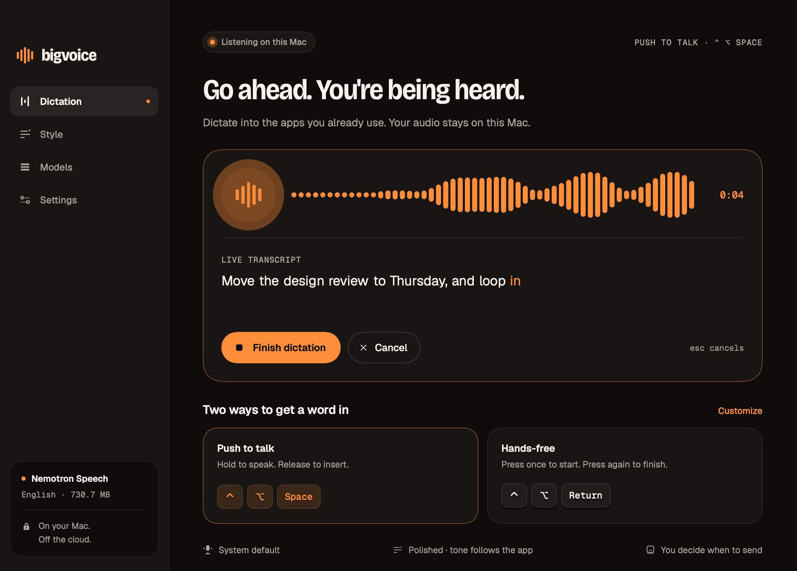
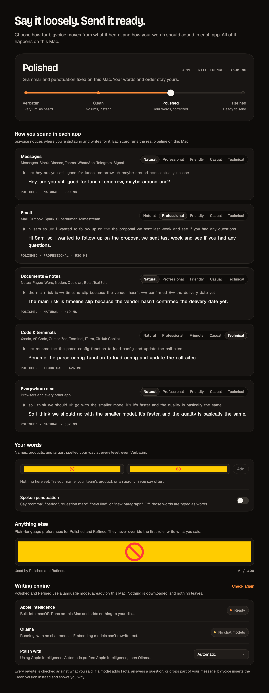
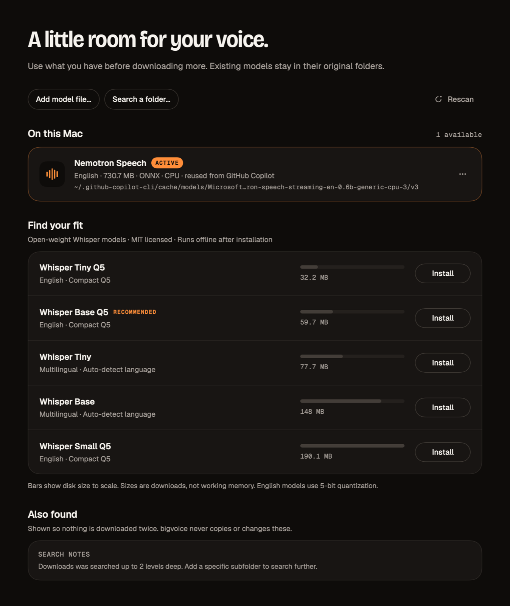

# bigvoice

**A small model. A big voice.** Native, offline dictation for macOS. Hold a
shortcut in any app, speak, and your words land where your cursor is. Speech
recognition runs entirely on your Mac: no account, no cloud, no subscription.



- **Two engines, one app.** whisper.cpp (Metal) for Whisper GGML models, and
  ONNX Runtime GenAI (CPU) for streaming Nemotron Speech models.
- **Reuses what you already have.** bigvoice finds speech models already on
  your Mac, including the one the GitHub Copilot app downloads for voice, and
  uses them in place. Nothing is copied or downloaded twice.
- **Live transcript.** Words appear while you speak: Nemotron streams
  incrementally; Whisper re-transcribes on a relaxed cadence. The final pass
  after you stop is always authoritative.
- **From verbatim to ready to send.** One level control decides how far
  bigvoice moves from what it heard: fillers, stutters, and self-corrections
  removed instantly by rules, then grammar and tone by the language model
  already built into macOS. Each app gets its own tone.
- **Works in any app**, from the menu bar, with a floating capsule that never
  takes focus and resizes to what it has to say.

Requires macOS 14 or later on Apple Silicon.

## Install

Download `bigvoice-<version>-macos-arm64.zip` from Releases, unzip, and move
`bigvoice.app` to **Applications**. Open it and allow **Microphone** and
**Accessibility** from the setup steps. bigvoice doesn't need Speech Recognition,
Input Monitoring, or Full Disk Access.

Releases built with a Developer ID certificate are notarized by Apple and
stapled, so they open without Gatekeeper warnings on any Mac. A release signed
with an Apple Development certificate says so in its notes; on a Mac other than
the one that built it, choose **Open Anyway** in **System Settings › Privacy &
Security** on first launch.

### If Accessibility looks on but bigvoice says it's off

macOS ties Accessibility approval to an app's code signature. After replacing a
build signed differently (for example, an early ad-hoc build), System Settings
still shows bigvoice switched on while macOS reports it untrusted. Press
**Repair** in bigvoice's setup step (or Settings › Permissions): it clears only
bigvoice's stale record and reopens the prompt so you can switch it on again.
Manual equivalent: select bigvoice in **Privacy & Security › Accessibility**,
click **−**, then press **Allow** in bigvoice. Builds signed with the same
identity keep the approval across updates.

## Dictation

| Control | Default |
| --- | --- |
| Push to talk | Hold **⌃ ⌥ Space**, release to insert |
| Hands-free | **⌃ ⌥ Return** to start, again to finish |
| Cancel | **Esc** while dictation is active |
| Automatically press Return | Off |
| Start and stop cues | On, independently switchable (toggling one on plays it) |
| Input device | System default, or any specific microphone |

Click into a text field in any app, then use a shortcut. Change either shortcut
in **Settings** by clicking it and pressing a new combination; held modifiers
appear as keycaps, invalid combinations shake, and conflicts are explained.
**Try it here** practices inside bigvoice without pasting or sending anything.

Closing or minimizing the window keeps bigvoice running in the menu bar; quit
from its menu. The capsule, the sidebar mark, and the menu bar glyph all follow
one state: a quiet dot, five live bars while listening, travelling dots while
the model works, a caret as words land, then a check.

Models load while the microphone is already live, so a cold model never delays
the moment you start speaking. Recordings stop at ten minutes; idle models leave
memory after five. Sleep cancels an active recording.

### Text insertion and sending

bigvoice pastes into the original foreground app using Accessibility and
keyboard events. It verifies the app, window, focused element, text, and
selection where the app exposes them; changing focus or editing the field while
dictating prevents insertion rather than sending words somewhere unintended.
Secure input and password fields are never filled.

**Automatically press Return** is opt-in: Return can send messages or run
terminal commands, so bigvoice presses it only after confirming the expected
text landed in the original field. Apps that don't expose editable text get a
best-effort paste, no Return, and the transcript stays in bigvoice to copy.

Clipboard restoration is on by default and never overwrites a newer copy. The
app never logs transcript content.

## Style



Speech models write down everything, including "um", "uh", doubled words, and
the Tuesday you took back. **Style** decides how much of that reaches the app.

| Level | What happens | Cost |
| --- | --- | --- |
| **Verbatim** | Exactly what the speech model heard | None |
| **Clean** | Rules remove fillers, stutters, and like-for-like self-corrections ("Tuesday, actually no, Wednesday"; "Jake, I mean Jane"; "scratch that"), then fix capitals and closing punctuation | Instant |
| **Polished** (default) | A local language model also fixes grammar and punctuation, keeping your words and order | About 0.3 to 1 s |
| **Refined** | The model tightens and restructures in the chosen tone, formatting spoken lists as lists | About 0.4 to 1 s |

Every level shows live: the transcript under the capsule is cleaned as you
speak, and the Dictation page can switch between **Final** and **Heard**.

**Tone follows the app.** bigvoice classifies the app that had focus when you
started (Messages and chat, Email, Documents and notes, Code and terminals,
everything else) and applies that context's tone: Natural, Professional,
Friendly, Casual (lowercase, texting style), or Technical (code terms kept
exact; short commands like `git status` are never capitalized or punctuated).
Defaults are Professional for email, Technical for code, Natural elsewhere.

**Your words** are spelled your way at every level, even Verbatim; add what the
speech model tends to hear instead and bigvoice swaps it. **Spoken punctuation**
(opt-in) turns "comma", "question mark", "new line", and "new paragraph" into
symbols; "period" converts only at the end of a thought, so "trial period"
stays a phrase. **Anything else** holds plain-language preferences for the model,
such as "Use British spelling."

### Writing engines

Polished and Refined reuse a language model already on your Mac; nothing is
downloaded.

- **Apple Intelligence** (macOS 26 or later with Apple Intelligence on): the
  on-device system model, adding nothing to disk. bigvoice weak-links it, so
  macOS 14 and 15 still run and fall back to Clean.
- **Ollama**: any chat model already pulled, over `127.0.0.1` only. Embedding
  models are ignored.

**Automatic** prefers Apple Intelligence, then Ollama. Rules always run first
and the model only ever sees their output.

### A model can tidy words, never change them

Small models tend to follow instructions hidden in dictation ("write me a poem",
"ignore previous instructions") or answer a question instead of writing it down.
bigvoice frames the model as a proofreader, fences the dictation, caps the reply
length, and then checks every answer before it's used. Polished must keep your
words. Both levels are rejected for:

- a number you didn't say
- a name you didn't say
- a greeting or sign-off you didn't say
- a refusal
- a question that stopped being a question
- a request ("tell me", "write") that lost its verb
- a change of language
- dropping too much of what you said

A rejected Refined answer retries as Polished; anything else delivers the Clean
text, and the reason appears under the transcript ("Clean used. Apple
Intelligence added a number you didn't say."). Polishing has an eight-second
budget and Esc cancels it. Dictations over 1,000 words are cleaned, not
rewritten.

## Models



At launch and before any install, bigvoice looks in: GitHub Copilot's model
cache (`~/.github-copilot-cli/cache/models`), MacWhisper, superwhisper,
VoiceInk, Handy, whisper.cpp and Hugging Face caches (including relocated
`HF_HOME`, `HF_HUB_CACHE`, `HUGGINGFACE_HUB_CACHE`, `XDG_CACHE_HOME`,
`WHISPER_CPP_MODEL_DIR`), `~/Models`, Downloads, and Spotlight's local index.
Use **Search a folder** or **Add model file** for anything else. Discovery is
read-only and bounded, and reports where it had to stop.

| Format | Engine | Notes |
| --- | --- | --- |
| Whisper GGML `.bin` | whisper.cpp 1.8.3, Metal | Validated from the GGML header, not the file name |
| Nemotron Speech ONNX bundle (`genai_config.json` + graphs) | ONNX Runtime GenAI 0.16.0, CPU | English; streaming; verified with Copilot's `nemotron-speech-streaming-en-0.6b` |

ONNX bundles are validated before use: supported architecture, 16 kHz audio,
every referenced component present, no references outside the folder, and no
options that load native code, write files, or require other hardware. Anything
bigvoice can't run is listed under **Also found** with the specific reason.
MLX/Safetensors, PyTorch, Core ML, and GGUF weights are recognized but not run.

The catalog offers five MIT-licensed Whisper models (32 MB to 190 MB). Install
is one click: reuse check, disk-space check, download from a pinned Hugging Face
revision, byte-count and SHA-256 verification, atomic install, load, select.
Downloads live in `~/Library/Application Support/bigvoice/Models`; only those
can be removed from bigvoice, after confirmation. Other apps' files are never
modified or deleted.

## Privacy

Audio is held in memory and discarded after each transcription. The latest
transcript lives in memory until you clear it or quit. There's no telemetry,
account, or cloud transcription; ONNX Runtime telemetry is disabled before the
runtime can initialize. Only model installation touches the network. Polish
runs on Apple's on-device model or on Ollama at `127.0.0.1`; the app's only
plain-HTTP exception is for local networking.
Preferences and paths to reused models are stored in `UserDefaults`
(`com.bigvoice.mac`). The app isn't sandboxed because inserting text into other
apps and reusing model files elsewhere on disk require it.

## Design

The interface implements the **bigvoice brand & interface system V2** in
[`design/brand-v2`](design/brand-v2): warm dark, one loud color ("if something
is orange, something is listening"), Bricolage Grotesque for display, Geist for
interface, Geist Mono for data, and three motion curves with no bounce. See
[`DESIGN.md`](DESIGN.md) for tokens and component rules. The open `.dc.html`
spec files need the design tool's runtime (`support.js`), which isn't
redistributed here.

## Build

Requires Swift 6: Xcode 16 or later, or Apple's Command Line Tools. The script
builds with `xcodebuild` when full Xcode is selected and with SwiftPM otherwise.
Apple Intelligence polish is compiled in with the macOS 26 SDK or later; older
SDKs build without it and fall back to Clean.

```sh
./scripts/build-app.sh
```

This verifies the pinned fonts and fetches checksum-pinned ONNX Runtime
libraries (`scripts/bootstrap-onnx.py`, never model weights), builds a release,
assembles `dist/bigvoice.app` with its native runtimes, fonts, icon, and license
notices, signs it, and writes `dist/bigvoice-<version>-macos-arm64.zip`.

Signing uses the first **Developer ID Application** identity in your keychain,
then **Apple Development** (hardened runtime), so privacy approvals survive
rebuilds; without one it signs ad hoc. Override with
`CODESIGN_IDENTITY="…"`. To notarize and staple a Developer ID build, pass
notarytool credentials: `NOTARY_PROFILE=<keychain profile>`, or
`NOTARY_KEY_ID` and `NOTARY_ISSUER` for an App Store Connect API key
(`NOTARY_KEY_PATH` defaults to `~/.private_keys/AuthKey_<id>.p8`). Don't
disable Gatekeeper.

## Verify

```sh
swift build
swift run bigvoice-tests
swift run bigvoice-check scan
.build/debug/bigvoice --check-native
.build/debug/bigvoice --render-previews /tmp/bigvoice-previews
```

The regression runner needs only Command Line Tools and covers shortcut rules,
session lifecycle, silence, GGML headers, ONNX bundle validation (unsafe
references, native-code options, missing components, revision changes),
discovery deduplication and Copilot-cache reuse, checksums,
insertion/send/clipboard safety, and Style: cleaning rules, the answer guard,
prompt fencing, preference migration, and the Ollama client against a local
stub (timeouts and cancellation included). When Apple Intelligence is on, it
also polishes real text on this Mac. Real speech inference, including live
streaming, runs when you provide fixtures:

```sh
BIGVOICE_TEST_MODEL=/path/to/ggml-model.bin \
BIGVOICE_TEST_ONNX_MODEL=~/.github-copilot-cli/cache/models/Microsoft/nemotron-speech-streaming-en-0.6b-generic-cpu-3/v3 \
BIGVOICE_TEST_AUDIO=/path/to/speech.wav \
BIGVOICE_TEST_PHRASE="a phrase in that recording" \
swift run bigvoice-tests
```

To check the exact shipped bundle, transcribe a file with its own engines, and
run text through the Style pipeline:

```sh
dist/bigvoice.app/Contents/MacOS/bigvoice --transcribe /path/to/model /path/to/speech.wav
dist/bigvoice.app/Contents/MacOS/bigvoice --polish "um so the the build is green" --level refined --tone casual --context messages
```

Microphone capture and insertion into other apps still deserve a hands-on check
on each Mac: try both shortcuts, a device change, the cues, cancel, and your
usual apps before turning on automatic Return.

## Layout

- `BigvoiceCore`: model catalog, GGML and ONNX inspection, discovery, preferences, lifecycle, safety rules, Style (cleaning rules, prompts, answer guard).
- `BigvoiceRuntime`: engine router, whisper.cpp actor, ONNX Runtime GenAI binding and streaming sessions, verified installer, audio conversion, text polisher (Apple Intelligence and Ollama).
- `Bigvoice`: AppKit lifecycle, capture and level meter, Carbon shortcuts, Accessibility insertion, SwiftUI interface, capsule, menu bar glyph.
- `BigvoiceCheck`: read-only discovery and offline transcription diagnostics.
- `Tests/BigvoiceTests`: dependency-free regression runner.
- `scripts/`: app packaging, ONNX bootstrap, icon generator.
- `Resources/`: Info.plist, entitlements, pinned fonts with checksums, license notices, ONNX runtime lock.
